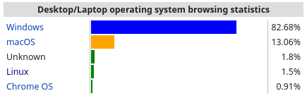
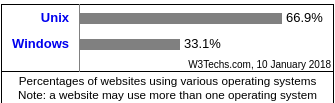
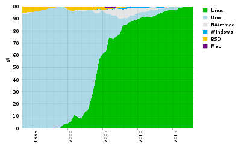
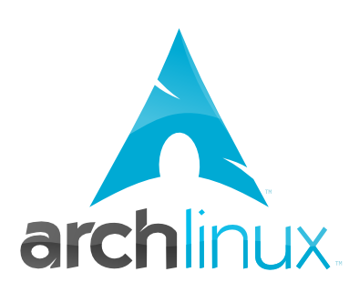
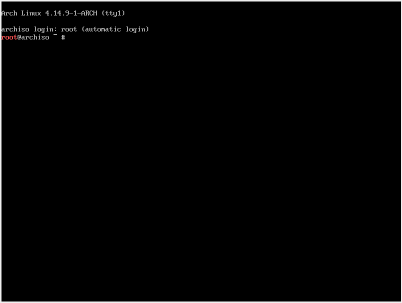

# Arch Linux 세미나 #1
SCSC 장필식

----

# Linux란?

- Free, Open-source operating system
- Linux Torvalds가 1991년에 만듬
- 세상에서 가장 많이 쓰이는 OS
    - Android가 Linux기반이기 때문...

---

# 가정용 컴퓨터 점유율

빼애액 아직까지 윈도우가 점유율 최대가 아닌가

(https://en.wikipedia.org/wiki/Usage_share_of_operating_systems)



---

# 서버 점유율

Linux는 인터넷을 지배하고 있다.

(https://w3techs.com/technologies/overview/operating_system/all)



---

# 슈퍼컴퓨터 점유율

현재 세계 500위 안의 슈퍼컴퓨터들은 전부 다 Linux를 차용하고 있다.

(https://en.wikipedia.org/wiki/Usage_share_of_operating_systems)



---

# Arch Linux란?



---

# Arch Linux의 철학

- DIY
- KISS
- RTFM

---

# DIY

"Do It Yourself".

Arch Linux는 OS의 핵심 기능들만 제외한 나머지를 유저에게 맞긴다.

GUI 환경, Display, Sound, User Management 등등...

With power comes great responsibility.

---

# KISS

"Keep it simple, stupid"

최대한 간단하게. 잡다한것 없이. 미니멀리즘.

- 꼭 필요한 기능만 제공하자.
- 쓸데없이 복잡하게 설계하지 말자.

---

# RTFM

"Read the ~~f***ing~~ fine manual"

모르는게 있을 때는 매뉴얼을 읽자.

- Man pages (``man <command>``), info (``info <keyword>``)
- Arch Linux wiki (https://wiki.archlinux.org)
    - 정말로 잘 되어있음. 문제의 70% 정도 이상을 여기서 해결할 수 있다!
- GIYF (Google is your friend)
    - 구글링도 매우 중요한 능력이다. 네이버는 가급적이면 피하자...
- 물론 이 세미나에서는 모르는게 있으면 얼마든지 도와드리겠지만... 구글링을 대신 해드리진 않습니다

---

# RTFM

(https://wiki.archlinux.org/index.php/Frequently_asked_questions)

<span style="font-size: 80%;">

## I am a complete GNU/Linux beginner. Should I use Arch?

If you are a beginner and want to use Arch, you must be willing to invest time into learning a new system, and accept that Arch is designed as a DIY (Do-It-Yourself) distribution; it is the user who assembles the system.

Before asking for help, do your own independent research by Googling, searching the forum and the superb documentation provided by the Arch Wiki. *There is a reason these resources were made available to you in the first place.* Many thousands of *volunteered* hours have been spent compiling this excellent information.

See also Arch terminology#RTFM and the Installation guide.

---

# 본격적인 시작

- VirtualBox에서 새로운 가상머신을 만든다. (Arch Linux (64bit)로 세팅)
- 세팅: 코어 1~2개, 램 1GB면 충분하다.

---

# 부팅한 후



---

# 연습: Bash

- 부팅하면 처음 시작하는 위치는 ``~/``, 혹은 ``/home``이다.
- 가장 상위의 디렉토리는 ``/``. root라고 부튼다.
- Absolute / Relative path:
    - ``/home/file.txt``: 루트 디렉토리에서 파일을 찾는다 (absolute)
    - ``file.txt`` or ``./file.txt``: 현재 디렉토리에서 파일을 찾는다 (relative)

연습: root의 컨텐츠를 한번 봐 보자.

---

# 연습: Bash

디렉터리 이동
- ``pwd``: 현재 디렉터리의 주소 보기
- ``ls``: 현재 디렉터리에 있는 파일들 보기
- ``ls <folder>``: 폴더 안의 파일들 보기
- ``ls -a``: 숨겨진 파일까지 모두 보기
- ``ls -l``: 파일들에 대한 더욱 자세한 내용 보기
- ``cd <folder>``: 폴더 들어가기
- ``cd ..``: 상위 디렉터리로 이동하기
- ``mkdir <folder>``: 폴더 만들기

---

# 연습: Bash

파일 생성/변경/제거
- ``touch <file>``: 파일 생성
- ``mv <file> <location>``: 파일 이름/위치 변경
- ``cp <file> <location>``: 파일 복사
- ``cp -r <folder> <location>``: 폴더와 그 안의 파일을 모두 복사
- ``rm <file>``: 파일 제거
- ``rm -r <folder>``: 폴더와 그 안의 파일들 모두 제거

주의: 명령을 되돌릴 수 있는 방법이 없으므로 조심, 또 조심!
특히 지금은 root 계정으로 로그인되어 있기 때문에, 무엇이든지 할 수 있다.

---

# man

해당 명령어에 대한 정보를 볼 수 있다.

MAN IS YOUR BEST FRIEND

---

# 연습: Vim

vimtutor를 해 보기.

---

# 추가 자료

Linux Tutorial
- https://ryanstutorials.net/linuxtutorial

Linux Cheat Sheet
- https://ryanstutorials.net/linuxtutorial/cheatsheet.php

지금까지 찾아본 걸로는 가장 잘 되어있음.

---

# 예제

다음과 같은 파일과 폴더들을 만들어라.

```txt
folder1
|_ apple1.txt
|_ apple2.txt
|_ apple3.txt
folder2
|_ subfolder1
   |_ apple4.txt
   |_ banana1.txt
|_ banana2.txt
folder3
|_ subfolder2
   |_ apple1.txt
   |_ apple2.txt
   |_ apple3.txt
```

``apple*.txt``에는 apple이라는 텍스트, ``banana*.txt``에는 banana라는 텍스트가 있어야 한다.

---

# 예제

- 시스템 어딘가에 tls-ca-bundle.pem라는 파일이 존재한다. 이것을 찾아라.
    - 힌트: 치트시트, Google, man, Arch Linux Wiki 등을 적절히 참고하자.

- 현재 시스템에 있는 C 소스 파일 (*.c 확장자를 가지는 파일)은 총 몇개인가?

- (심화) 학생들의 성적이 들어있는 텍스트 파일 scores.txt이 있다. 다음 링크에서 다운로드를 받자. (어떻게 다운받는지는 안알랴줌) 
    - 성적표 중간에 알 수 없는 오류로 인해서 몇 개의 항목이 중복되었다. 이 중복된 항목들을 없애서 scores_unique.txt에 저장하라.
    - 1등부터 10등까지의 학생 이름을 한 줄씩 담고 있는 파일 top_ten.txt을 만들어라. (힌트: cut, sort를 영리하게 사용하면 된다.)
    (힌트: awk '{ print $2 " " $1 }'를 통해 테이블의 첫번째와 두번째 열을 바꿀 수 있다.)

---

# 그럼 이젠 본격적인 시작

여기부터는 ppt가 없습니다...

---

# 끄으읕

---
